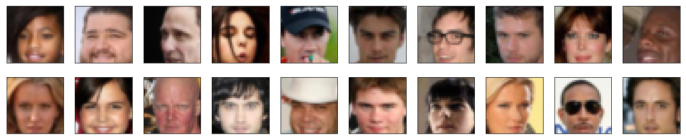
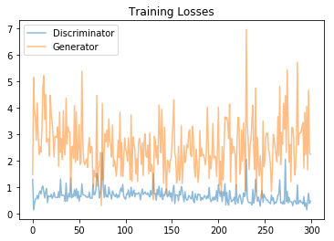
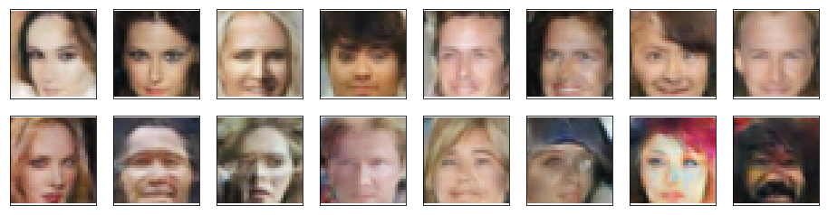

# Face Generation

A project from Deep Learning Nanodegree at Udacity

## Overview

The project consists of generating face images based on a provided celebreties dataset.
The proposed solution is a deep learning neural network called _Generative Adversarial Network_ comprised of two
neural networks.

- Generator
- Discriminator

This network was created by Ian Goodfellow in [Generative Adversarial Networks] paper.

## Dataset

The dataset can be found at [CelebFaces Attributes Dataset (CelebA)].

**Sample**

## Results

In this section you can see both generator and discriminator loss after being trained for `20` epochs with a learning rate of
`0.0002`.

After being trained, fake faces have been generated.

[Generative Adversarial Networks]: https://arxiv.org/abs/1406.2661
[CelebFaces Attributes Dataset (CelebA)]: http://mmlab.ie.cuhk.edu.hk/projects/CelebA.html