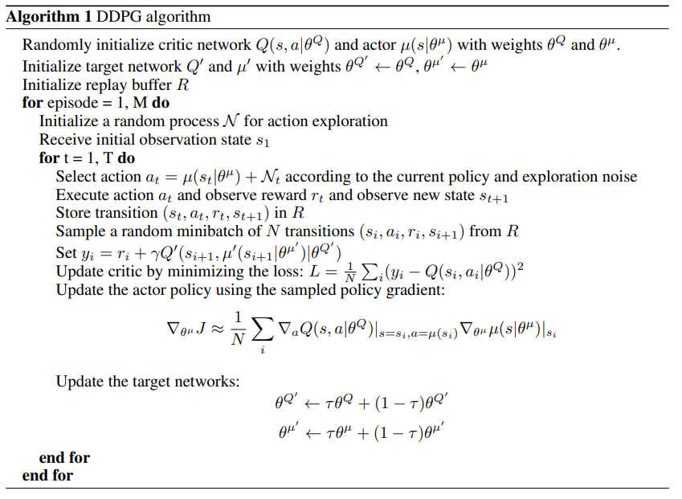

# Report

In this project two rackets (agents) have been trained to keep the ball in the air as much as possible.
To do so, a Unity environment was provided with the following description:

- Observation space: 8 variables corresponding to position and velocity of the ball and the rackets.
- Action space: the actions comprise moving forward, backwards, and jumping.

To solve the environment, an average score of +0.5, over 100 consecutive episodes and over all agents,
must be achieved.

## Environment Information

Below, the information related to the environment is shown. 
Verifying the information given above.

```text
INFO:unityagents:
'Academy' started successfully!
Unity Academy name: Academy
        Number of Brains: 1
        Number of External Brains : 1
        Lesson number : 0
        Reset Parameters :
		goal_size -> 5.0
		goal_speed -> 1.0
Unity brain name: ReacherBrain
        Number of Visual Observations (per agent): 0
        Vector Observation space type: continuous
        Vector Observation space size (per agent): 33
        Number of stacked Vector Observation: 1
        Vector Action space type: continuous
        Vector Action space size (per agent): 4
        Vector Action descriptions: , , ,
```

## Deep Deterministic Policy Gradient (DDPG)

To solve the environment, an agent was trained with an off-policy method called DDPG, without any additional noise.

<p align="center">
    
</p>

<p align="center">
    Figure 1: Pseudocode describing the DDPG implementation. Extracted from "Continuous Control with Deep Reinforcement
Learning", Google DeepMind.
</p>

This algorithm is an Actor-Critic model-free method used to solve problems where the action domain is continuous.

## Neural Network

Two networks were used to estimate the optimal policy, the actor and the critic.

- **Actor**

```python
nn.Sequential(
    nn.Linear(input_size, 128),
    nn.ELU(),
    nn.BatchNorm1d(128),
    nn.Linear(128, 64),
    nn.ELU(),
    nn.Linear(64, 32),
    nn.ELU(),
    nn.Linear(32, 16),
    nn.ELU(),
    nn.Linear(16, output_size),
    nn.Tanh(),
)
```

- **Critic**

```python
nn.Sequential(
    nn.Linear(input_size, 256),
    nn.ELU(),
    nn.BatchNorm1d(256),
    nn.Linear(256, 128),
    nn.ELU(),
    nn.Linear(128, 64),
    nn.ELU(),
    nn.Linear(64, 32),
    nn.ELU(),
    nn.Linear(32, 1),
)
```

Each network consists mainly of fully-connected layers with ELU activation functions.
As usual, the optimizer is _Adam_, and the hyperparameters are the following:

```python
class Hyperparameters:
    GOAL = 0.51                 # Environment Goal
    AVG_OVER = 100              # Averaged score
    N_EPISODES = 3000           # Number of episode for training
    MAX_TIMESTEPS = 1000        # Max Timesteps
    BUFFER_SIZE = 12000         # Replay Buffer Size
    BATCH_SIZE = 256            # Minibatch Size
    GAMMA = 0.995               # Discount Gamma
    TAU = 1e-3                  # Soft Update Value
    LR_ACTOR = 1e-3             # Actor learning rate
    LR_CRITIC = 1e-3            # Critic learning rate
    UPDATE_EVERY = 2            # Update network every X intervals
    N_EXPERIENCES = 4           # Times to learn from batch of experiences
    OU_MU = 0.0                 # Noise parameters
    OU_SIGMA = 0.2              # Volatility
    OU_THETA = 0.15             # Speed of mean reversion
    EPSILON = 1                 # Noise exploration epsilon
    EPSILON_MIN = 0.01          # Noise exploration minimum
    EXPLORATION_STEPS = 12000   # Exploration steps related to N_EXPERIENCES
```

## Results

The following results were obtained:

```text
Episode 1000	Average Score: 0.25	Max Reward: 2.600   Buffer: 1.0	Noise: 0.010    Timestep: 66090
Episode 1010	Average Score: 0.26	Max Reward: 2.600	Buffer: 1.0	Noise: 0.010	Timestep: 68161
Episode 1020	Average Score: 0.30	Max Reward: 2.600	Buffer: 1.0	Noise: 0.010	Timestep: 70596
Episode 1030	Average Score: 0.34	Max Reward: 2.600	Buffer: 1.0	Noise: 0.010	Timestep: 72420
Episode 1040	Average Score: 0.40	Max Reward: 2.700	Buffer: 1.0	Noise: 0.010	Timestep: 75903
Episode 1050	Average Score: 0.43	Max Reward: 2.700	Buffer: 1.0	Noise: 0.010	Timestep: 78011
Episode 1060	Average Score: 0.44	Max Reward: 2.700	Buffer: 1.0	Noise: 0.010	Timestep: 79315
Episode 1070	Average Score: 0.48	Max Reward: 2.700	Buffer: 1.0	Noise: 0.010	Timestep: 81411
Episode 1080	Average Score: 0.51	Max Reward: 2.700	Buffer: 1.0	Noise: 0.010	Timestep: 83302
Episode 1081	Average Score: 0.51
Environment solved in 1081 episodes!	Average Score: 0.51
```

Score over all the episodes:

![Score][Score]

## Future Work

There are quite a few improvements to be done. 
The learning was done applying Experience Replay, but the agent could perform better if Prioritized Experience Replay
were to be implemented.
In terms of the network, more advanced units could be used.
It seems that the feedback signals are time-series, thus recurrent neural units could be applied in conjunction with
transformers which are cutting-edge technology in this field.
Lastly, it would be very interesting to compare DDPG with other model-based continuous algorithm, as I believe
that the classical methods are so robust that working together with these data-driven techniques could be extremely
powerful.

[Score]: ./maddpg_score.png
