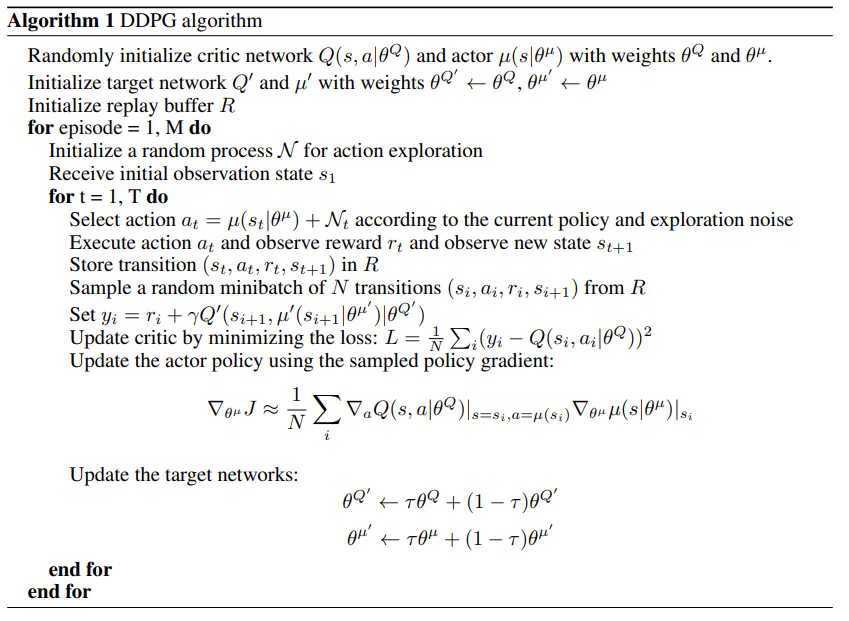

# Report

In this project a double-jointed arm has been trained to keep its head at the nearest position possible from
the moving target.
To do so, a Unity environment was provided with the following description:

- Observation space: 33 variables corresponding to position, rotation, velocity, and angular velocities of the arm.
- Action space: Each action is a vector of 4 numbers, corresponding to torque applicable to two joints.
Each component of the action vector must be in the `[-1, 1]` range.

To solve the environment, an average score of +30, over 100 consecutive episodes and over all agents, must be achieved.

## Environment Information

Below, the information related to the environment is shown. 
Verifying the information given above.

```text
INFO:unityagents:
'Academy' started successfully!
Unity Academy name: Academy
        Number of Brains: 1
        Number of External Brains : 1
        Lesson number : 0
        Reset Parameters :
		goal_size -> 5.0
		goal_speed -> 1.0
Unity brain name: ReacherBrain
        Number of Visual Observations (per agent): 0
        Vector Observation space type: continuous
        Vector Observation space size (per agent): 33
        Number of stacked Vector Observation: 1
        Vector Action space type: continuous
        Vector Action space size (per agent): 4
        Vector Action descriptions: , , ,
```

## Deep Deterministic Policy Gradient (DDPG)

To solve the environment, an agent was trained with an off-policy method called DDPG, without any additional noise.

<p align="center">
    
</p>

<p align="center">
    Figure 1: Pseudocode describing the DDPG implementation. Extracted from "Continuous Control with Deep Reinforcement
Learning", Google DeepMind.
</p>

This algorithm is an Actor-Critic model-free method used to solve problems where the action domain is continuous.

## Neural Network

Two networks were used to estimate the optimal policy, the actor and the critic.

- **Actor**

```python
nn.Sequential(
    nn.BatchNorm1d(state_size),
    nn.Linear(state_size, 128),
    nn.ELU(),
    nn.BatchNorm1d(128),
    nn.Linear(128, 64),
    nn.ELU(),
    nn.BatchNorm1d(64),
    nn.Linear(64, 32),
    nn.ELU(),
    nn.BatchNorm1d(32),
    nn.Linear(32, action_size),
    nn.Tanh(),
)
```

- **Critic**

```python
# Model 1 
nn.Sequential(
    nn.BatchNorm1d(state_size),
    nn.Linear(state_size, 128),
    nn.ELU(),
)

# Model 2
nn.Sequential(
    nn.Linear(128 + action_size, 64),
    nn.ELU(),
    nn.Linear(64, 32),
    nn.ELU(),
    nn.Linear(32, 16),
    nn.ELU(),
    nn.Linear(16, 1),
    nn.ELU(),
)
```

Each network consists mainly of fully-connected layers with ELU activation functions.
It was tested that, given the architecture, the ELU activation functions outperforms all the others, namely ReLU6,
SELU, LeakyReLU, etc.
The ReLU6 does not learn from the environment as the SELU does.
The latter solves the environment in about 110 episodes, but the ELU solves the environment much faster, at around 80
episodes.
Thus, the ELU activation function was selected.

As usual, the optimizer is _Adam_, and the hyperparamters are the following:

```python
__BUFFER_SIZE = int(1e6)  # Replay buffer size
__BATCH_SIZE = 256        # Minibatch size
__GAMMA = 0.995           # Discount factor
__TAU = 0.01              # For soft update of target parameters
__LR_ACTOR = 1e-3         # Actor Learning rate
__LR_CRITIC = 1e-3        # Critic Learning rate
__UPDATE_EVERY = 32       # Network update rate
__N_EPISODES = 160        # Number of episodes
__MAX_TIMESTEPS = 1000    # Max number of timesteps per episode
__GOAL = 35               # Goal to consider the problem solved
__N_EXPERIENCES = 16      # Number of experiences to learn from
__AVG_OVER = 100          # Number of scores to average over
```

## Results

The following results were obtained:

```text
Episode 10	Average Score: 2.31
Episode 20	Average Score: 13.80
Episode 30	Average Score: 19.94
Episode 40	Average Score: 23.80
Episode 50	Average Score: 26.47
Episode 60	Average Score: 28.50
Episode 70	Average Score: 29.89
Episode 80	Average Score: 30.94
Episode 90	Average Score: 31.60
Episode 100	Average Score: 32.08
Episode 109	Average Score: 35.21
Environment solved in 109 episodes!	Average Score: 35.21
```

Score over all the episodes:

![Score][Score]

## Future Work

There are quite a few improvements to be done. 
The learning was done applying Experience Replay, but the agent could perform better if Prioritized Experience Replay
were to be implemented.
An interesting observation took place by switching activation functions, and with activation functions, such as
ReLU6, the agent was unable to learn. 
Researching about this problem would be quite interesting, and ultimately making it work in this environment.
In terms of the network, more advanced units could be used.
It seems that the feedback signals are time-series, thus recurrent neural units could be applied in conjunction with
transformers which are cutting-edge technology in this field.
Lastly, it would be very interesting to compare DDPG with other model-based continuous algorithm, as I believe
that the classical methods are so robust that working together with these data-driven techniques could be extremely
powerful.

[Score]: ./ddpg_arm_score.png
[Random Score]: ./dizzy_arm_score.png
